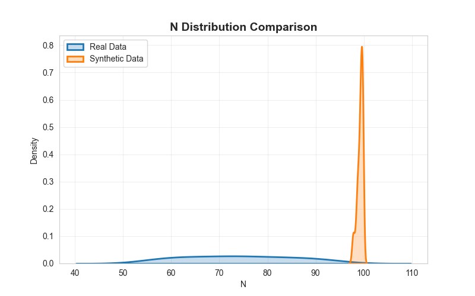
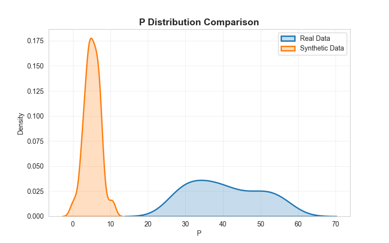
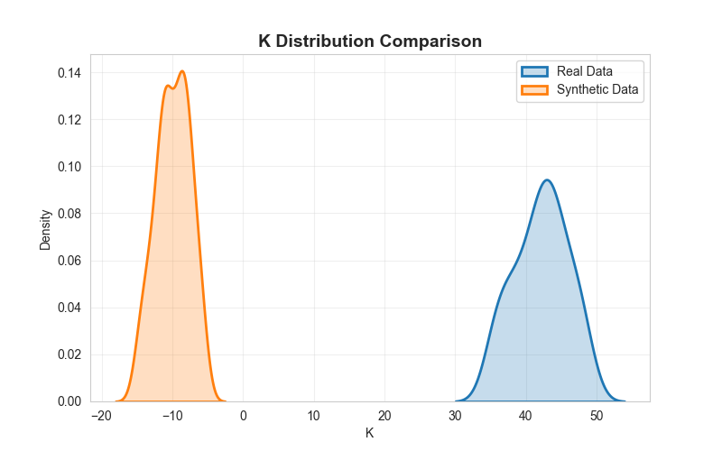
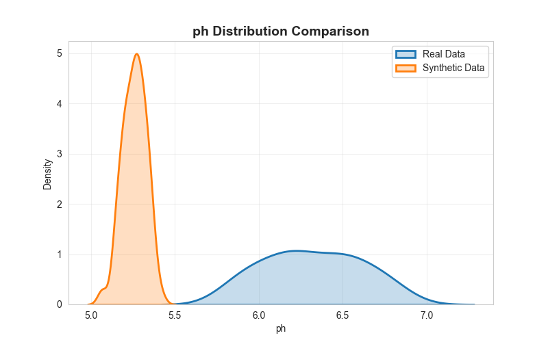
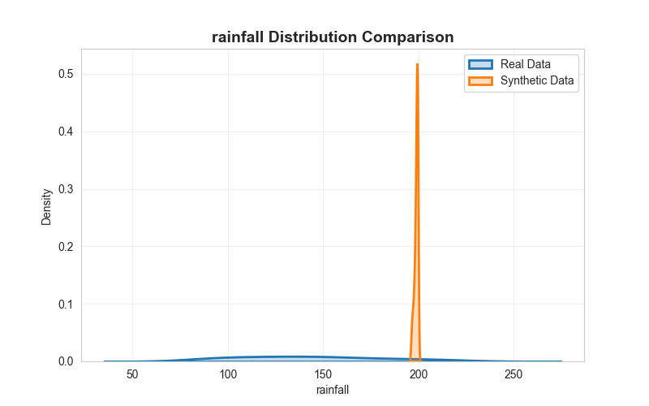
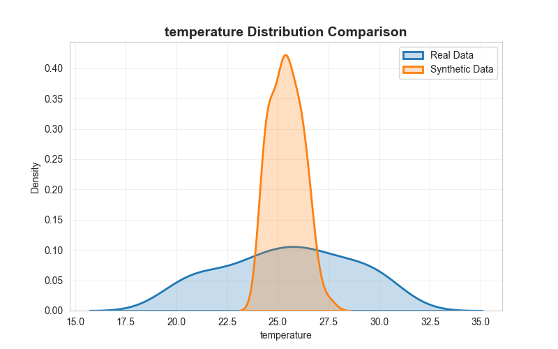
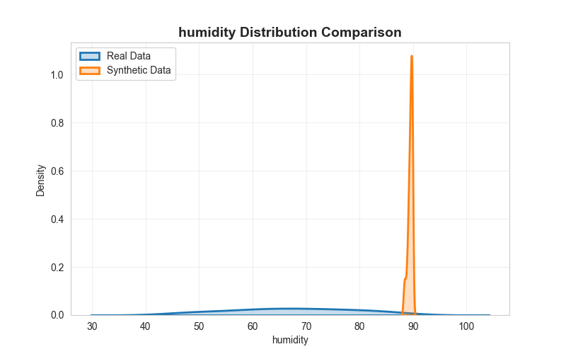

## Results

These graphs compare real vs synthetic data generated using GAN.

---

### 🌱 Nitrogen (N)

### 🌱 Phosphorus (P)

### 🌱 Potassium (K)

### 🌱 Ph 

### 🌡 Rainfall

### 🌡 Temperature

### 💧 Humidity

